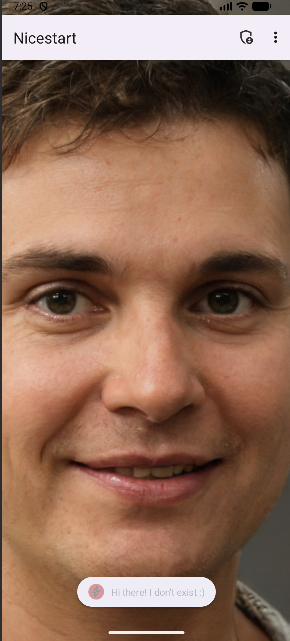
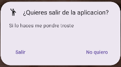
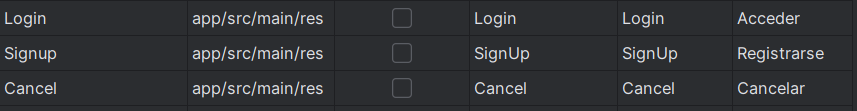
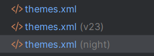
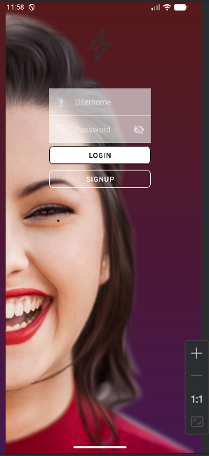
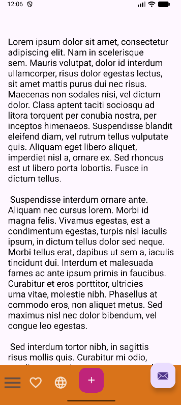
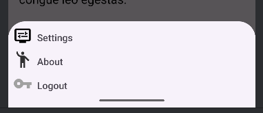

This **repository** is the creation of a page done in Juan de la Cierva School for the DAM2º education.

Images of the pages that are being created while working on this proyect:

**Login page:**
For this and the nex page I used the glide extension to put the background image

**Signup page:**

**Splash page:**
For this page I used the glide extension too for the background image, also i made an animation for
for the thunder in the splash

**Profile page:**
In the profile there is not a lot of information more than the image and text.

**Main page:**
In the main page I used a swipe refresh layout using the thispersondoesnotexist page, theres also a 
top bar that gets you to a bottom app bar page with the settings button.

**LogOut Menu**
Menu that apear after pressing log out in the main menu.

**Landscape view**
Added a landscape view for the main activity

**Language texts**
For some of the text of the app you can change your language between spanish and english and it will
change to that language

**Night mode**
Added a night mode for the aplication that changes automatically when it detects that the phone is 
in night or not

**Bottom app bar**
Page with a scrolling view and a bottom app bar with some buttons that show a toast or show a menu
with three diferent options

>This project is under creative common
>[Creativecommons Org Licensed By Sa 4](https://creativecommons.org/licenses/by-sa/4.0)